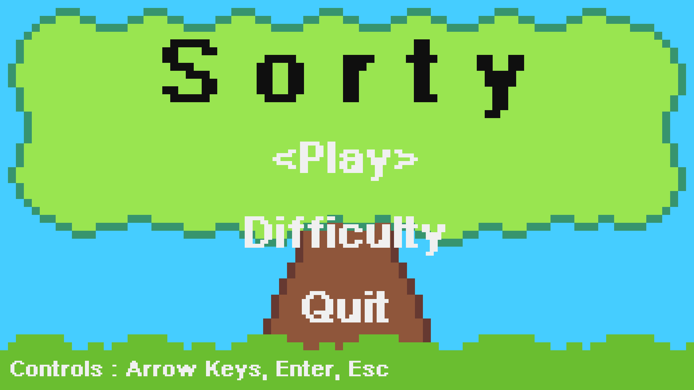
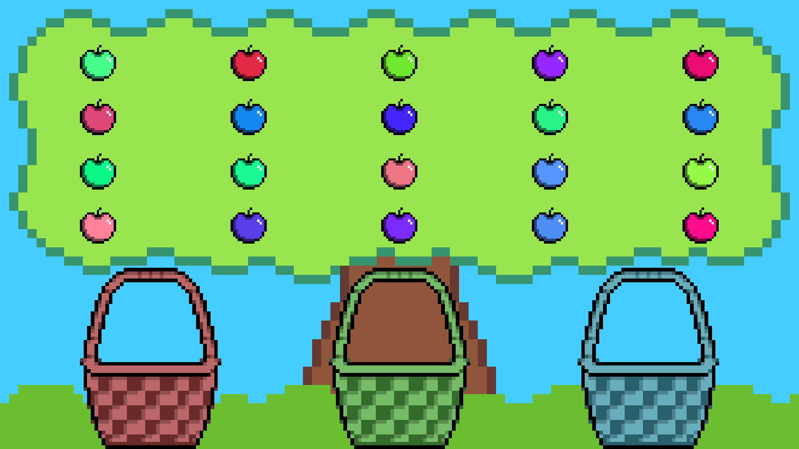

# Sorty

A little game made with pygame...

## Dependencies

See [requirements.txt](requirements.txt).

## Running the game

You can run Sorty with the following command:

`python3 app`

## How to play

Sorty is a score based game, your task is to place apples into the right basket based on their major colour. The more you get right, the better your score.

## Controls

### Menu

Use your mouse or the following hotkeys of your keyboard:

- **Arrow Keys** for navigation
- **Enter** for selection
- **Escape** for going up in the Menu or quitting the game when you can't go up

### Game

Drag and drop apples using your mouse.

If you want to go back to Menu, press **Escape**

## Difficulty settings

Sorty presents 4 levels of difficulty which differ in what is the difference between major and second-major colour of the apple.

## Screenshots

- Main menu

- Game

